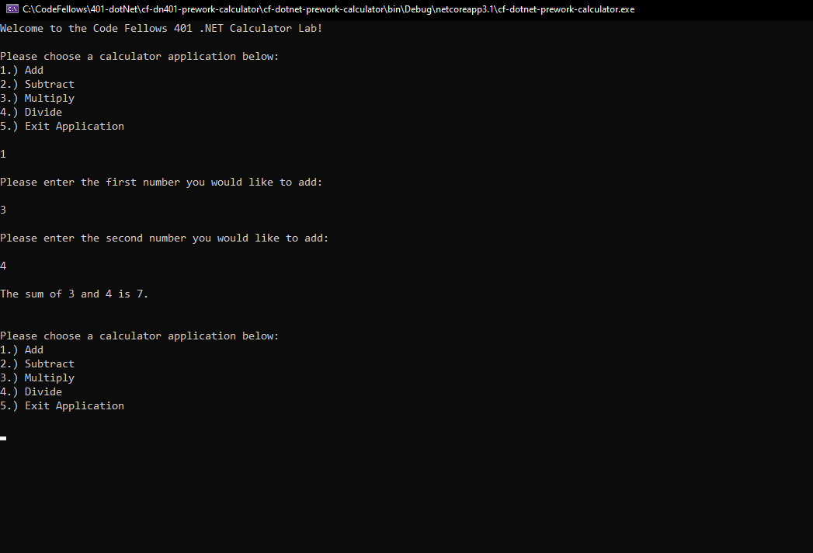
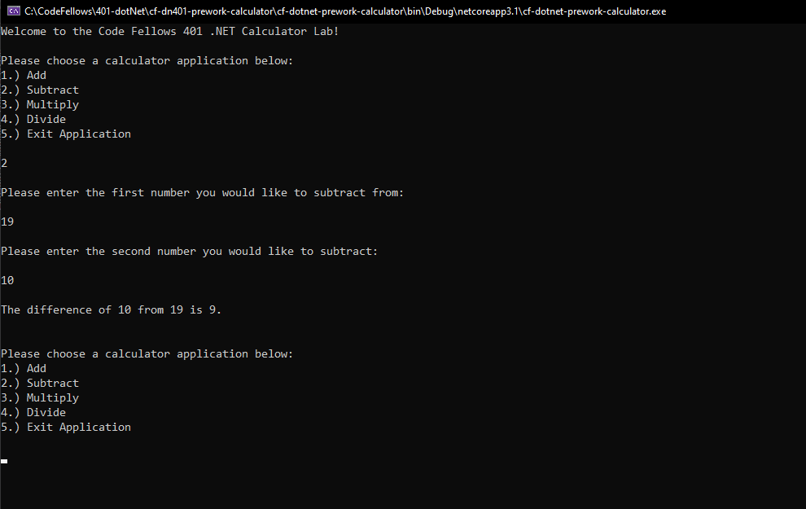
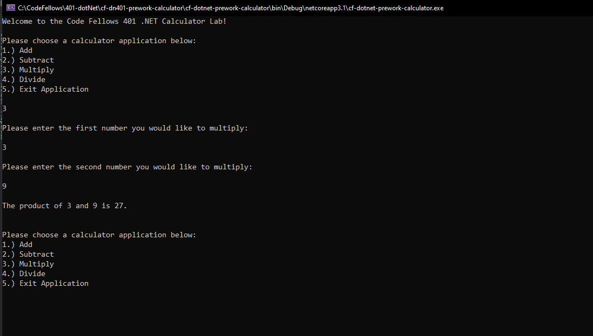
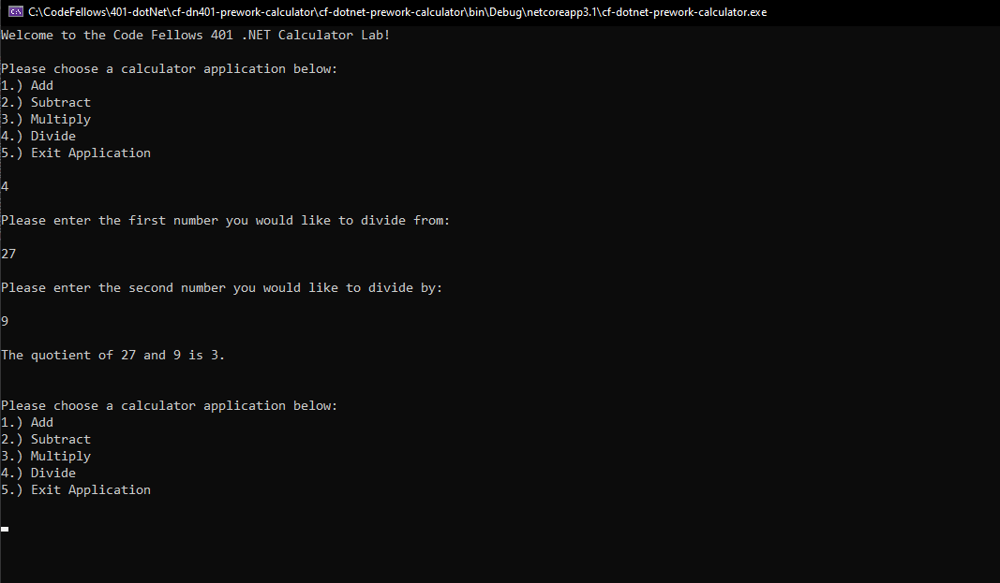

# cf-dn401-prework-calculator
Code Fellows - 401 ASP.NET Prework Calculator Lab  
_Author: [Robert Nielsen](https://github.com/robertjnielsen)_

## Description
This is a simple C# console application that asks the user if they would like to run one of four methods to Add, Subtract, Multiply or Divide two numbers. It then returns the final value of the operation, and then asks the user of they would like to run another method, or exit the application.

## Getting Started
First, clone this repository to your machine.  

`$ git clone [repo url here]`  

Then open Visual Studio, select `File` -> `Open` -> `Project / Solution`  

Next navigate to the location where you cloned the repository on your local machine, and double click the `cf-dn401-prework-calculator` directory.  

Within that directory, select and open the `cf-dotnet-prework-calculator.sln` file.

Finally, run the application from within Visual Studio by pressing `CTRL + F5` on your keyboard, or by navigating to the `Debug` menu and clicking on `Start Without Debugging`.

## Images

**Add Method**

**Subtract Method**

**Multiply Method**

**Divide Method**

## Change Log
**1.5**: 2020-03-16
- Images and README updated.

**1.4**: 2020-03-16
- Divide method complete.

**1.3**: 2020-03-16
- Multiply Method Complete

**1.2**: 2020-03-16
- Subtract method complete.

**1.1**: 2020-03-16
- Add method complete.

**1.0**: 2020-03-16
- Initial repository commit.
- Menu method completed.